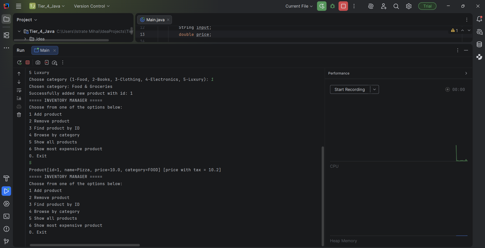

# Java Inventory Manager

### Tier 4 — OOP Advanced: Generics, Enums, Exceptions, and Interfaces



## 📌 Overview

A robust, multi-class Java CLI application for managing a product inventory. This system demonstrates advanced Object-Oriented Programming concepts by implementing a type-safe inventory using **generics**, categorizing products with a feature-rich **enum**, handling errors with custom **exceptions**, and enforcing contracts with **interfaces**. The application allows users to add, remove, search, and filter products while automatically calculating taxes based on category.

## 🧠 Concepts Demonstrated

*   **Generics (`<T>`)** — The `Inventory<T extends Identifiable>` class provides a type-safe container that can work with any class implementing the `Identifiable` interface.
*   **Enums with State & Behavior** — The `Category` enum is not just a list of constants; it encapsulates a `displayName`, a `taxRate`, and a method `calculateTax()`, demonstrating how enums can have fields and methods.
*   **Custom Exceptions** — `DuplicateProductException` (checked) and `ProductNotFoundException` (unchecked) provide specific, meaningful error handling for inventory operations.
*   **Interfaces for Abstraction** — The `Identifiable` interface defines a clear contract (`id()`, `category()`, `priceWithTax()`), allowing the generic `Inventory` to operate on any object that fulfills these requirements.
*   **Records as Data Carriers** — `Product` is implemented as a modern Java `record`, providing a concise way to create an immutable data carrier with implicit constructor, accessors, `equals()`, `hashCode()`, and `toString()`.
*   **Polymorphism & Dynamic Dispatch** — The `Inventory` works with the `Identifiable` interface, so methods like `priceWithTax()` are called on the specific object type (`Product`) at runtime.
*   **Exception Handling & Input Validation** — The `Main` class uses try-catch blocks to gracefully handle invalid user input (e.g., non-numeric IDs, negative prices) and prevent application crashes.

## 🗂️ Project Structure

```
Tier_4_Java_Inventory/
└── src/
    ├── Main.java
    └── Modules/
        ├── Identifiable.java # Interface defining the contract for inventory items
        ├── Product.java # Record implementing Identifiable (id, name, price, category)
        ├── Category.java # Enum with display names and tax rates
        ├── Inventory.java # Generic inventory class with array-based storage
        ├── DuplicateProductException.java # Custom checked exception
        └── ProductNotFoundException.java # Custom unchecked exception
```


## 🛒 Core Features

| Feature | Description |
| :--- | :--- |
| **Add Product** | Add a new product with a unique ID, name, price, and category. Prevents duplicate IDs. |
| **Remove Product** | Remove a product from the inventory by its ID. |
| **Find by ID** | Search for and display a specific product using its unique identifier. |
| **Browse by Category** | Filter and display all products belonging to a selected category (Food, Books, etc.). |
| **Show All Products** | Display a list of all products in the inventory, including their price with tax. |
| **Find Most Expensive** | Identify and display the product with the highest base price. |
| **Automatic Tax Calculation** | Each category has a fixed tax rate, automatically applied to calculate the `priceWithTax()`. |

## 🔧 Key Components

### `Identifiable` (Interface)
The core contract for any item that can be stored in the inventory.
```java
public interface Identifiable {
    int id();
    Category category();
    double priceWithTax();
    double price();
}
```

### `Category` (Enum)
Demonstrates an enum with data and behavior. Each constant has a display name and a tax rate.
```java
public enum Category {
    FOOD("Food & Groceries", 0.02),
    ELECTRONICS("Electronics", 0.20);
    // ...
    public double calculateTax(double price) { return price * taxRate; }
}
```

### `Inventory<T extends Identifiable>` (Generic Class)

A type-safe, array-based container. It enforces that only objects implementing Identifiable can be added,
ensuring all necessary methods (like id()) are available.

### `ProductNotFoundException & DuplicateProductException` (Generic Class)

Custom exceptions that make error handling in the Main class and Inventory class much
clearer and more specific than using generic Exception types

---

## 🖥️ Sample Console Output

```
===== INVENTORY MANAGER =====
Choose from one of the options below:
1 Add product
2 Remove product
3 Find product by ID
4 Browse by category
5 Show all products
6 Show most expensive product
0. Exit

... (after adding several products) ...

===== INVENTORY MANAGER =====
Choose from one of the options below:
... (menu) ...
5

Product[id=1, name=Laptop, price=1200.0, category=ELECTRONICS] [price with tax = 1440.0]
Product[id=2, name=Java Book, price=45.0, category=BOOKS] [price with tax = 45.0]
Product[id=3, name=Jeans, price=80.0, category=CLOTHING] [price with tax = 89.6]

The most expensive product is: Product[id=1, name=Laptop, price=1200.0, category=ELECTRONICS]
```

---

## 🚀 How to Run

1. Clone the repository.
2. Open the project in IntelliJ IDEA (or any Java IDE) with JDK 21 or later.
3. Run the Main.java file located in the src/ directory.

Or from the terminal:
```bash
# Navigate to the project's src directory
cd path/to/Tier_4_Java_Inventory/src

# Compile all Java files
javac -d out Main.java Modules/*.java

# Run the Main class
java -cp out Main
```

---

## 📚 Part of
[Java Mastery — 20 - Tier Curriculum](https://github.com/istrate-mihai/)
`Tier 1` ✅ → `Tier 2` ✅ → `Tier 3` ✅ → **`Tier 4`** ✅ → Tier 5 🔒
